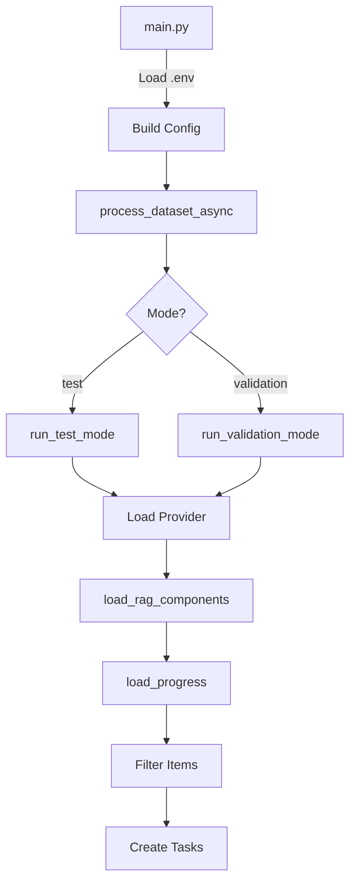
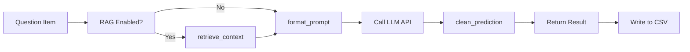
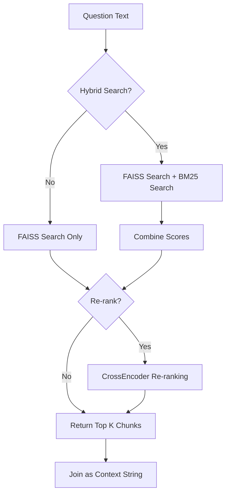

# Architecture & Workflow Guide

## Quick Reference

This document provides a visual and detailed explanation of how the VNPT AI Water Margin codebase is organized and how data flows through the system.

## 📊 Visual Architecture


## 🏗️ Modular Architecture

The project has been refactored from a monolithic 405-line file into **11 focused modules** organized into 3 packages:

```
src/
├── utils/         🔧 Utility Functions
├── RAG/           🔍 Retrieval-Augmented Generation  
└── core/          ⚙️ Core Processing Logic
```

### Package Responsibilities

| Package | Purpose | Key Files |
|---------|---------|-----------|
| **utils/** | Reusable utilities for formatting, parsing, progress tracking | `prompt.py`, `prediction.py`, `progress.py` |
| **RAG/** | Document retrieval with hybrid search and re-ranking | `loader.py`, `retriever.py`, `build_index.py` |
| **core/** | Main processing orchestration and item handling | `config.py`, `processor.py`, `runner.py` |

---

## 🔄 Execution Flow

### 1. Initialization Flow



### 2. Per-Item Processing Flow



### 3. RAG Retrieval Flow



---

## 📦 Module Details

### utils Package

#### `prompt.py` - Prompt Formatting
```python
# Input: Question item + optional context
format_prompt(item, context=None)

# Output: Chat messages for LLM
[
    {"role": "system", "content": "Bạn là trợ lý AI..."},
    {"role": "user", "content": "Context: ...\nQuestion: ..."}
]
```

**Key Features:**
- Formats Vietnamese multiple-choice questions
- Generates choice labels (A, B, C, D...)
- Prepends RAG context when available

#### `prediction.py` - Answer Extraction
```python
# Input: LLM response text
clean_prediction("Đáp án: B. Vì AI là...")

# Output: Single letter
"B"
```

**Parsing Strategies:**
1. Look for "Đáp án:" pattern
2. Look for "Đáp án đúng:" pattern
3. Look for "Vậy đáp án là" pattern
4. Check last characters for uppercase letter
5. Fallback to default ("C")

#### `progress.py` - Checkpoint Management
```python
# Load existing progress
processed_qids, existing_results = load_progress("results/test.csv")
# → {qid1, qid2, ...}, [result1, result2, ...]

# Filter items to process
items_to_process = filter_items(all_items, processed_qids)
# → Only unprocessed items

# Display progress
display_progress_info(processed=31, total=370, remaining=340)
# → "📊 Progress: 31/370 complete. Processing 340 remaining items..."
```

---

### RAG Package

#### `loader.py` - Component Loading
```python
faiss_index, bm25_index, text_chunks, cross_encoder = load_rag_components(config)
```

**Loads:**
- ✅ FAISS index (768-dim embeddings)
- ✅ BM25 index (tokenized Vietnamese)
- ✅ Text chunks (JSON)
- ✅ CrossEncoder model (for re-ranking)

**Error Handling:**
- Gracefully disables RAG if components fail to load
- Prints informative status messages

#### `retriever.py` - Context Retrieval
```python
context = await retrieve_context(
    question="Trí tuệ nhân tạo là gì?",
    provider=vnpt_provider,
    config=config,
    faiss_index=index,
    bm25_index=bm25,
    text_chunks=chunks,
    cross_encoder=encoder
)
# → "AI là công nghệ...\n\nTrí tuệ nhân tạo giúp..."
```

**Retrieval Modes:**

| Mode | Description | When to Use |
|------|-------------|-------------|
| **Dense Search** | FAISS only (semantic similarity) | Fast, simple retrieval |
| **Hybrid Search** | FAISS + BM25 (semantic + keyword) | Best accuracy, configurable weights |
| **Re-ranking** | CrossEncoder on initial results | Precision-focused retrieval |

---

### core Package

#### `config.py` - Configuration
```python
DEFAULT_CONFIG = {
    "MODEL_NAME": "vnptai-hackathon-large",
    "CONCURRENT_REQUESTS": 2,
    "RAG_ENABLED": False,
    "TOP_K_RAG": 3,
    # ... 20+ config options
}

# Merge configs
final_config = merge_config(DEFAULT_CONFIG, user_config)
```

#### `processor.py` - Item Processing
```python
result = await process_item(
    item={'qid': '001', 'question': '...', 'choices': [...]},
    provider=vnpt_provider,
    config=config,
    semaphore=asyncio.Semaphore(2),
    faiss_index=index,
    bm25_index=bm25,
    text_chunks=chunks,
    cross_encoder=encoder
)
# → {'qid': '001', 'answer': 'B', 'prediction_raw': '...', ...}
```

**Processing Steps:**
1. ⏸️ **Acquire semaphore** (concurrency control)
2. 🔍 **Retrieve context** (if RAG enabled)
3. 📝 **Format prompt** (with context)
4. 🤖 **Call LLM** (async API request)
5. ⏱️ **Sleep** (if rate limiting configured)
6. 🔤 **Parse answer** (extract A/B/C/D)
7. ✅ **Return result** (with metadata)

#### `runner.py` - Orchestration
```python
# Main entry point
await process_dataset(
    input_file='data/test.json',
    output_file='results/test.csv',
    config=config,
    mode='test'  # or 'valid'
)
```

**Test Mode Features:**
- ✅ Checkpoint/resume (loads existing CSV)
- ✅ Incremental saving (write after each item)
- ✅ Progress bar with tqdm
- ✅ Submission file generation

**Validation Mode Features:**
- ✅ Real-time accuracy calculation
- ✅ Detailed results with ground truth
- ✅ Progress bar with accuracy display
- ✅ Final accuracy report

---

## 🔀 Data Structures

### Question Item
```python
{
    "qid": "001",
    "question": "Trí tuệ nhân tạo là gì?",
    "choices": [
        "Một loại robot",
        "Công nghệ mô phỏng trí tuệ con người",
        "Phần mềm máy tính",
        "Thiết bị phần cứng"
    ],
    "answer": "B"  # Optional, only in validation set
}
```

### Result Dictionary
```python
{
    "qid": "001",
    "answer": "B",
    "prediction_raw": "Phân tích: AI mô phỏng... Đáp án: B",
    "ground_truth": "B",  # Only in validation mode
    "is_correct": True     # Only in validation mode
}
```

### Configuration Dictionary
```python
{
    # Provider settings
    "CHAT_PROVIDER": "vnpt",
    "MODEL_NAME": "vnptai-hackathon-large",
    
    # Performance
    "CONCURRENT_REQUESTS": 2,
    "SLEEP_TIME": 0,
    
    # RAG settings
    "RAG_ENABLED": True,
    "TOP_K_RAG": 3,
    "HYBRID_SEARCH_ENABLED": True,
    "RERANK_ENABLED": True,
    
    # LLM hyperparameters
    "PAYLOAD_HYPERPARAMS": {
        "temperature": 0.5,
        "top_p": 0.7,
        "max_completion_tokens": 2048
    }
}
```

---

## 🚀 Example Execution Trace

```
1. START: main.py
   └─→ Load config from .env

2. ORCHESTRATE: core/runner.py → run_test_mode()
   ├─→ Load dataset: 370 items
   ├─→ Initialize VNPT provider
   └─→ Load RAG components
       ├─→ ✅ FAISS index: 1,247 vectors
       ├─→ ✅ BM25 index loaded
       └─→ ✅ CrossEncoder loaded

3. RESUME: utils/progress.py
   ├─→ Found existing CSV: 31 items processed
   └─→ Filter: 340 items remaining

4. PROCESS: core/processor.py (parallel, 2 concurrent)
   
   [Item 32]
   ├─→ RAG/retriever.py: Hybrid search
   │   ├─→ BM25 scores: compute
   │   ├─→ FAISS search: compute embeddings
   │   ├─→ Combine scores (0.5 semantic + 0.5 keyword)
   │   └─→ Return top 3 chunks
   ├─→ utils/prompt.py: Format with context
   ├─→ providers/vnpt.py: Call API
   │   └─→ Response: "Phân tích... Đáp án: B"
   ├─→ utils/prediction.py: Extract answer
   │   └─→ Result: "B"
   └─→ Write to CSV
   
   [Item 33] ... parallel execution ...

5. COMPLETE
   ├─→ Results: results/test_vnpt_async.csv
   └─→ Submission: results/submission.csv
```

---

## 🎯 Key Design Principles

1. **Separation of Concerns**
   - Each module has a single, clear responsibility
   - Easy to test and modify independently

2. **Backwards Compatibility**
   - Old code using `async_running.py` still works
   - New code can import from specific modules

3. **Async-First**
   - All I/O operations are async
   - CPU-bound tasks (FAISS, BM25) run in executors

4. **Graceful Degradation**
   - RAG failures don't crash the system
   - Missing components are handled gracefully

5. **Progress Persistence**
   - Automatic checkpointing
   - Resume from any interruption point

---

## 📚 Further Reading

- [README.md] - Project overview and quick start
- [AGENTS.md] - Detailed architecture documentation
