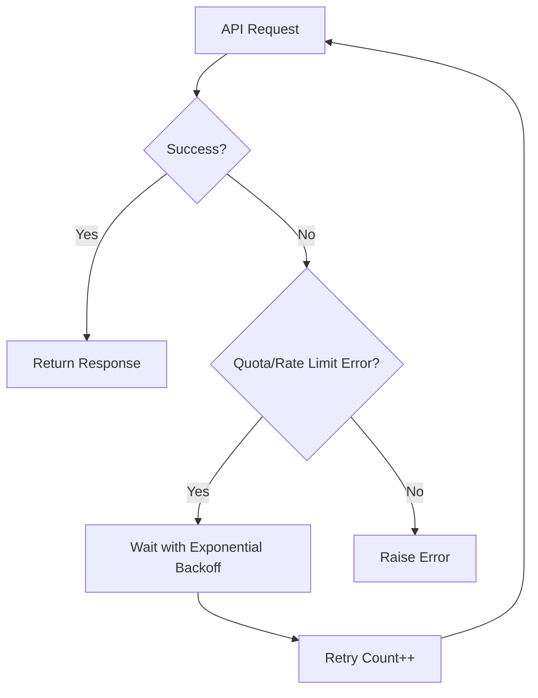

# Infinite Retry for VNPT Quota Limits

## Overview

The VNPT provider now includes **automatic infinite retry with exponential backoff** to handle quota limits gracefully. Instead of failing when hitting rate limits, the system will automatically retry requests with increasing delays.

## How It Works

### Retry Strategy



### Exponential Backoff

- **Initial delay**: 5 seconds (configurable)
- **Backoff strategy**: Delay doubles after each retry
- **Maximum delay**: 5 minutes (300 seconds, configurable)
- **Retry limit**: Infinite (until successful)

**Example progression:**
```
Retry #1: Wait 5s
Retry #2: Wait 10s
Retry #3: Wait 20s
Retry #4: Wait 40s
Retry #5: Wait 80s
Retry #6: Wait 160s
Retry #7: Wait 300s (capped at max)
Retry #8: Wait 300s
...
```

### Errors That Trigger Retry

The retry mechanism activates for:

- **HTTP 429** - Too Many Requests
- **HTTP 5xx** - Server errors
- **Quota errors** - Messages containing "quota", "rate limit", or "too many requests"
- **Network errors** - Connection timeouts or network issues

## Configuration

### Environment Variables

Add to your `.env` file:

```dotenv
# Enable/disable infinite retry (default: true)
VNPT_INFINITE_RETRY=true

# Initial retry delay in seconds (default: 5)
VNPT_RETRY_INITIAL_DELAY=5

# Maximum retry delay in seconds (default: 300 = 5 minutes)
VNPT_RETRY_MAX_DELAY=300
```

### Recommended Settings

#### For Development (Faster Feedback)
```dotenv
VNPT_INFINITE_RETRY=true
VNPT_RETRY_INITIAL_DELAY=2
VNPT_RETRY_MAX_DELAY=60
```

#### For Production (Respects Quotas)
```dotenv
VNPT_INFINITE_RETRY=true
VNPT_RETRY_INITIAL_DELAY=10
VNPT_RETRY_MAX_DELAY=600
```

#### Disable Retry (Fail Fast)
```dotenv
VNPT_INFINITE_RETRY=false
```

## Usage Examples

### Example 1: Running with Infinite Retry

```pwsh
# Set environment variables
$env:VNPT_INFINITE_RETRY="true"
$env:SLEEP_TIME="0"  # Can reduce/remove sleep time since retry handles quotas

# Run your script
python main.py
```

**Output when quota hit:**
```
Processing item 45/370...
⚠️  Quota/Rate limit hit (HTTP 429). Retry #1 after 5.0s...
⚠️  Quota/Rate limit hit (HTTP 429). Retry #2 after 10.0s...
✓ Request successful after 2 retries
Processing item 46/370...
```

### Example 2: Combining with Sleep Time

You can still use `SLEEP_TIME` for preventive rate limiting:

```dotenv
# Proactive approach: space out requests
SLEEP_TIME=60

# Reactive approach: retry on quota errors  
VNPT_INFINITE_RETRY=true
VNPT_RETRY_INITIAL_DELAY=10
```

### Example 3: Running Test Scripts

```pwsh
# Your existing test scripts now benefit from retry automatically
python test/running_classi_llm_small.py
```

The test will continue running even if quotas are hit, automatically retrying after appropriate delays.

## Benefits vs. Sleep Time Approach

| Approach | Pros | Cons |
|----------|------|------|
| **Sleep Time Only** | Simple, predictable timing | Wastes time even when quota available |
| **Infinite Retry** | Only waits when needed, automatic recovery | May spend long time retrying |
| **Both Combined** | Best of both worlds | More complex configuration |

## Monitoring

### Console Output

When retries occur, you'll see clear warnings:

```
⚠️  Quota/Rate limit hit (HTTP 429). Retry #3 after 20.0s...
⚠️  Network error: Connection timeout. Retry #1 after 5.0s...
⚠️  Quota error detected: Rate limit exceeded. Retry #5 after 80.0s...
```

### Logging

For production monitoring, consider adding logging:

```python
# In your code
import logging
logging.basicConfig(level=logging.INFO)
```

## Advanced: Programmatic Control

You can also control retry behavior programmatically:

```python
from src.providers.vnpt import VNPTProvider

# Create provider with custom retry settings
provider = VNPTProvider()
provider.enable_infinite_retry = True
provider.initial_retry_delay = 10
provider.max_retry_delay = 600
```

## FAQ

### Q: Will this slow down my processing?

**A:** Only when quotas are hit. The retry only activates on errors, so normal processing speed is unchanged.

### Q: Can I disable retry for specific requests?

**A:** Set `VNPT_INFINITE_RETRY=false` in your environment, or disable it programmatically on the provider instance.

### Q: What if I want to retry a limited number of times?

**A:** The current implementation retries infinitely. If you need a retry limit, you can modify the `_retry_with_backoff` method to add a `max_retries` parameter.

### Q: Does this work for both chat and embedding?

**A:** Yes! Both `achat()` and `aembed()` methods use the retry mechanism.

## Migration Guide

### Before (Manual Quota Handling)
```python
SLEEP_TIME=90  # Always wait 90 seconds
# If quota hit, script fails
```

### After (Automatic Retry)
```python
SLEEP_TIME=0  # Or reduce significantly
VNPT_INFINITE_RETRY=true
# If quota hit, automatically retries
```

### Recommended Transition
```python
# Phase 1: Keep both for safety
SLEEP_TIME=60
VNPT_INFINITE_RETRY=true

# Phase 2: After confirming it works, reduce sleep
SLEEP_TIME=10
VNPT_INFINITE_RETRY=true

# Phase 3: Rely primarily on retry
SLEEP_TIME=0
VNPT_INFINITE_RETRY=true
```
